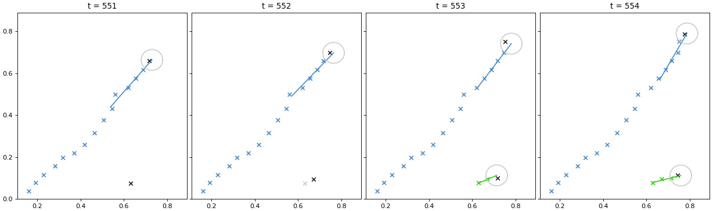

## LinReg Object Tracker
A motion tracker that uses linear regression to predict the trajectory  of items on screen to determine which items belong to which objects.

### track_objects() Function
Uses linear regression to predict the trajectory of items on screen to determine which items belong to which objects.

Required Inputs:
**IMPORTANT**: Make sure that the x and y values are scaled such that they are between 0 and 1. 
* x -> Shape (n, ). The x coordinates of each of n objects. 
* y -> Shape (n, ). The y coordinates of each of n objects. 
* t -> Shape (n, ). The time stamps of each of n objects. 

Optional Inputs: 
* m -> The number of most recent items in each object used to calculate the polynomial's parameters. 
* bound_tight -> The maximum euclidean distance an item can be from an object's predicted location to be considered a member of that object.
* time_limit -> The amount of time that can pass before an object is considered "inactive". Once that many time steps have passed  since that object was assigned a new item, then that object is considered too old, and will no longer be used in future tracking.
* vb -> A list of t values. The program will plot all of the active objects and items on screen for each of the t values provided.
* vb_save -> A string containing a file path. If vb_save is set, the program will save all of the plots from the timestamps defined in vb to the file path specified. For example, if vb_save = "C:\image" and vb = [1,3], then two files C:\image_00001.png and C:\image_00003.png will be saved. Use backslashes rather than slashes for the file path

Outputs:
* obj_list -> A list of objects. Each entry contains a list of the indices of all items belonging to that object.

### track_plot() Function
A function used by track_objects to plot the results. This function is fairly useless outside of the context of its use in the track_objects() function.

### Required Libraries
* numpy
* matplotlib

### Selecting an m Value
The higher the m-value the more linear the predicted trajectory becomes. If the value is too high then the function would fail to detect any changes in direction or speed.

The lower the m-value the more labile the predicted trajectory becomes. If the m-value is 2, for example, then the trajectory would simply be the line that the last two points went through. The trajectory would therefore become easily influenced by noise.

A good m value is therefore a value that is small enough to detect changes in trajectory without being too small. The ideal m value largely depends on the frame rate of your data. It is recommended that you use the default value, then use the verbose plotting function to decide whether or not the value should be increased or decreased. 

### Selecting a bound_tight Value
This value depends on how much noise exists in your data set. If the noise is nearly non-existant, then the bound could be very low with no issue. If there is a lot of noise, then you may need a larger bound to make sure the algorithm correctly identifies points in each object. 

If the bound_tight is too small, then the predicted trajectories may be over-segmented (when the true trajectory of an object is incorrectly identified as multiple objects), or fail to see the objects at all.

If the bound_tight is too large, then the algorithm may incorrectly assign items to the wrong objects (under-segmentation).

Again, it is recommended that you use the default, then use the verbose plot function to decide whether or not the value needs to be changed. 

### Selecting a time_limit Value
This value depends on how quickly you wish to discount objects. If your dataset has objects that travel through the scene very quickly, then a small time_limit value could be useful, whereas a dataset that has objects that move slowly through the scene could use a larger value. Again, it is recommended that you use the default, then use the verbose plot function to decide whether or not the value needs to be changed. 

### Limitations
This motion tracker is intended to be used for close-to-linear objects with very little drastic changes in the trajectory. It can detect objects if the trajectory is changing slowly over time, but it is not intended for detecting rapid changes. It would be very bad, for example, at detecting a ball bouncing off of a wall since the change in direction would be too drastic for the algorithm to detect. Similarly, a ball falling to the ground might be too non-linear for the algorithm to detect. 

Further, this motion tracker does not take into account the visual appearance of objects in any way. This motion tracker could, for example, have a hard time differentiating two objects who arrive in close proximity to each other, where other motion trackers that utilize image detection could differentiate the two objects more readily.  

### Example:
This example uses items that were found by using background detection on a video of cars moving down a street. Each of the points represents a car that was detected.

The plot below shows 4 frames taken from the aforementioned data set. 

The blue object demonstrates how items are assigned to existing objects. The blue “x” points are all of the items belonging to the blue object*, the blue line is the calculated trajectory of that object, the end of the line represents the predicted location of that object in this time frame, and the grey circle shows the bound_tight distance from the predicted location. The black “x” points represent items in this time frame that have not yet been classified. You can see that in each frame there is an item within the grey circle, and so each of those items is added to the blue object. 
*Note: The blue items are all from previous time frames. They are shown simply to show the motion of the object over time.

The green object demonstrates how new objects are created. At t=551 you can see an item that is not assigned to any object (the black “x” at the bottom of the plot). At t=552, you can see the item from the previous frame (shown in grey) next to a new item (shown in black). These two points are considered a potential new object. The algorithm decides that there are enough items in the future trajectory of this potential object, and so the green object is created. You can see in t=553 and t=554 that new items are within the bound_tight distance and are therefore added to the green object.

The animation below shows the object tracking results superimposed on the source video. 

As you can see the algorithm works well even when there are multiple objects on screen at the same time, and even when the motion of the object is non-linear.
